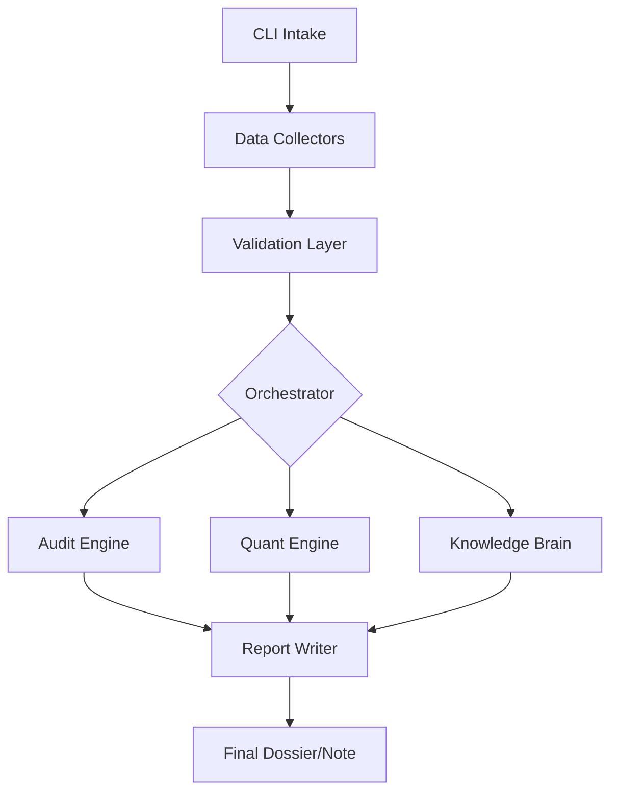

# ??? ChainLens: On-Chain Due Diligence & Quantitative Research Agent

**ChainLens** is a production-grade agent designed for real traders, researchers, and analysts to perform rigorous due diligence on blockchain protocols, tokens, and smart contracts. 

Unlike many AI tools that rely on black-box predictions, ChainLens is built on a foundation of **determinism, verifiability, and financial rigor**. It separates a rule-based audit engine from a formula-based quantitative engine, ensuring that every output is either a **cited fact** or a **statistical estimate**.

---

## ?? Core Capabilities

### ?? Deterministic Audit Engine
*   **Risk Heuristics:** Analyzes ownership, mint authority, honeypot patterns, liquidity locks, and blacklist/pausable functions.
*   **Evidence-Based:** Every finding is labeled as a **fact** and attached to a citation (transaction hash, contract address, or source line).
*   **Risk Scoring:** Generates a transparent 0-100 risk score based on configurable weights.

### ?? Quantitative Metrics Engine
*   **Closed-Form Math:** Computes volatility, log returns, Maximum Drawdown (MDD), Sharpe Ratio, and Value-at-Risk (VaR) using NumPy/pandas.
*   **Concentration Analysis:** Calculates Herfindahl-Hirschman Index (HHI) and Gini coefficients to assess holder distribution.
*   **Rigor First:** Rejects calculations with insufficient sample sizes; strictly avoids price forecasting.

### ?? Evolving Knowledge Core (Second Brain)
*   **Gated RAG:** A self-improving knowledge loop that crawls arXiv, IEEE, and audit reports.
*   **Quality Gate:** Sources pass through a 7-step credibility and relevance filter before entering the "Brain."
*   **Non-Mutating:** New knowledge contextualizes reports but never silently alters the deterministic core logic.

### ?? Learn & Research Modes
*   **Research Dossier:** Combines audit findings, quant metrics, and tokenomics into a unified research report.
*   **Interactive Tutor:** Explains complex on-chain concepts and metrics with real-world, cited examples.

---

## ??? Technical Architecture



- **Language:** Python 3.11+
- **Packaging:** `uv` (ultra-fast Python package manager)
- **Data Validation:** Pydantic v2
- **CLI Framework:** Typer & Rich
- **Math Stack:** NumPy, pandas
- **Knowledge Store:** Vector Index + Markdown-synced Ledger

---

## ?? Getting Started

### Installation
```bash
# Clone the repo
git clone https://github.com/dungnotnull/On-Chain-Due-Diligence-Quantitative-Research-Agent.git
cd On-Chain-Due-Diligence-Quantitative-Research-Agent

# Install using uv
pip install uv
uv sync
```

### Configuration
Copy the example environment file and fill in your API keys:
```bash
cp .env.example .env
```
Required keys: RPC URLs, Etherscan API Key, and Market Data providers.

### Usage
```bash
# Run the main interactive agent
python -m chainlens.cli.main

# Run specific modes directly
# Audit a contract
python -m chainlens.cli.audit --address 0x... --chain ethereum

# Run quantitative analysis
python -m chainlens.cli.quant --token "ETH" --window 90d

# Start a knowledge crawl
python -m chainlens.cli.brain_crawl
```

---

## ?? Guardrails & Philosophy

ChainLens is built for high-stakes environments where accuracy is paramount:
- **No Advice:** It does NOT provide financial advice, trading signals, or price predictions.
- **No "Safe" Labels:** It never labels a token as "safe," only as having "lower observed risk based on signals."
- **Data Integrity:** If data is stale or corrupted, the agent aborts rather than extrapolating.
- **Transparency:** Every metric output includes the lookback window, sample size, and data source.

---

## ?? Author
Created by **Codex**.

## ?? License
MIT License. See `LICENSE` for details.
